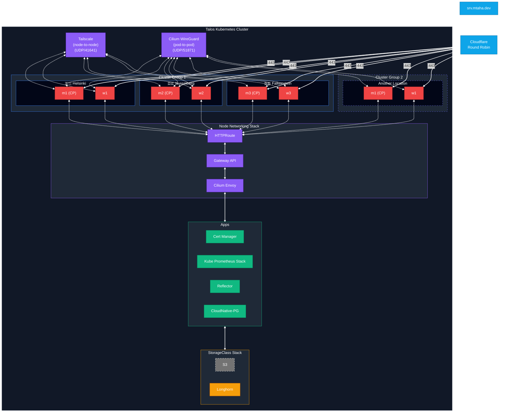
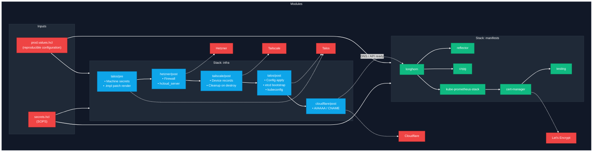

# k8s.tf - Kubernetes Cluster IaC with OpenTofu/Terraform + Terragrunt

End-to-end Kubernetes infrastructure managed with **OpenTofu** modules and orchestrated
by **Terragrunt** as a layered stack and DAG. The cluster runs on **Talos Linux**
with **Hetzner Cloud** for compute, **Tailscale** for node-to-node networking,
**Cloudflare DNS** for domain management, and core cluster services including storage,
observability, and certificate management.

**Key Features:**
- Multi-region Talos Kubernetes clusters with dual-stack networking
- Cilium CNI with WireGuard encryption for pod-to-pod communication
- Gateway API for ingress with Envoy load balancing
- SOPS + age encryption for sensitive configuration
- Terragrunt stack-based deployment with dependency management
- Centralized mock outputs for plan/destroy without applied state

<br>

## Architecture Overview



<br>

## Prerequisites


| Tool                  | Role                                               |
| --------------------- | -------------------------------------------------- |
| OpenTofu or Terraform | Provider and resource engine                       |
| Terragrunt            | Stack generation, `run --all`, DAG                 |
| `sops` + `age`        | Encryption for `secrets.hcl` / `packer/secret.hcl` |
| `kubectl`             | Cluster access before manifest plan/apply          |
| `jq`                  | SOPS status check during `make generate`           |
| Packer (optional)     | Talos image build for Hetzner                      |

<br>

## Quick Start

### 1. Secrets

```sh
cp secrets.hcl.example secrets.hcl
# Fill in your credentials (must be plain text before encryption) (https://github.com/FiloSottile/age)
export SOPS_AGE_KEY_FILE=~/.config/sops/age/keys.txt
make encrypt
```

To edit secrets later: `make decrypt` → edit → `make encrypt`.

### 2. Cluster Configuration

Update `infra` (cluster name, `cluster_url`, nodes, firewall, versions) and `apps`
blocks in `prod.values.hcl` for your environment.

### 3. Generate Stack and Apply

Default environment is **prod** (`ENV=prod`). `make generate` requires `secrets.hcl`
to be **decrypted**.

```sh
# Apply entire stack (infrastructure then manifests)
make apply

# Or apply layers separately
make infra-apply
make manifests-apply
```

> [!NOTE]
> Manifest targets require a valid kubeconfig and reachable API server.

---

### Repository Architecture

All shared configuration lives under `locals` in `prod.values.hcl`. Sensitive values such as API tokens are stored in `secrets.hcl` and encrypted with **SOPS**.

| Layer              | Content                                                                                                                                                                  |
|:------------------:|:------------------------------------------------------------------------------------------------------------------------------------------------------------------------:|
| **Infrastructure** | Talos machine secrets, patch templates, Hetzner servers + firewall, Tailscale devices, Talos bootstrap, kubeconfig, Cloudflare DNS records                              |
| **Manifests**      | Longhorn, Reflector, CloudNativePG (CNPG), kube-prometheus-stack, cert-manager, plus optional **testing** unit (nginx, echoserver)                                        |

---

### Dependency Graph



> [!NOTE]
> Dependencies are defined in module `terragrunt.hcl` files via `dependency` blocks.
> The `skip_outputs` setting uses `common.hcl` locals to enable plan/destroy without
> applied upstream state. Mock outputs match actual output types for type safety.

---

### Repository Layout

```
/
├── terragrunt.stack.hcl               # Root stack: infra + manifests value injection
├── prod.values.hcl                    # Single source of truth (cluster, nodes, app versions)
├── secrets.hcl                        # Never committed in plain text; encrypted with SOPS
├── secrets.hcl.example                # Template
├── .sops.yaml                         # SOPS / age rules
├── Makefile                           # generate, plan, apply, SOPS, packer, lint
├── modules/
│   ├── common.hcl                     # Backend, provider versions, mock outputs, shared helpers
│   ├── infra/                         # Base infrastructure modules (Talos, Hetzner, Tailscale, Cloudflare)
│   │   ├── terragrunt.stack.hcl       # Defines infra stack units and dependencies
│   │   ├── talos/
│   │   │   ├── pre/                   # Machine secrets + config generation
│   │   │   ├── post/                  # Config apply, bootstrap, kubeconfig
│   │   │   └── templates/             # .tmpl patch files
│   │   ├── hetzner/
│   │   │   ├── pre/                   # Placeholder (no resources)
│   │   │   └── post/                  # Servers, firewall, private network
│   │   ├── tailscale/
│   │   │   ├── pre/                   # Placeholder (no resources)
│   │   │   └── post/                  # Device discovery, IP resolution
│   │   └── cloudflare/
│   │       ├── pre/                   # Placeholder (no resources)
│   │       └── post/                  # DNS records (A/AAAA/CNAME)
│   └── manifests/                     # Application modules
│       ├── terragrunt.stack.hcl       # Defines manifests stack units and dependencies
│       └── core/
│           ├── longhorn/              # Distributed block storage
│           ├── reflector/             # Secret/configmap reflection
│           ├── cnpg/                  # CloudNativePG operator
│           ├── kube-prometheus-stack/ # Monitoring stack
│           ├── cert-manager/          # ACME certificates + Gateway
│           └── testing/               # Smoke tests (nginx, echoserver)
│
└── packer/                            # Optional Talos image build for Hetzner
    ├── hetzner.pkr.hcl                # Packer template
    ├── prod.pkrvars.hcl               # Packer variables (image name, Talos version)
    ├── secret.hcl                     # Packer-specific SOPS-encrypted secrets
    └── ...
```

> [!NOTE]
> When `make generate` runs, Terragrunt reads `terragrunt.stack.hcl` and generates unit
> directories under **`.terragrunt-stack/`**; the Makefile cleans these intermediate
> directories after plan/apply. Each module's `terragrunt.hcl` includes `common.hcl` for
> shared backend config, provider versions, and mock outputs.

<br>

## Other Environments

Production is defined by **`terragrunt.stack.hcl`** and **`prod.values.hcl`**. For another
environment (e.g., dev), create `dev.values.hcl` and use `make apply ENV=dev`. The stack
file reads the matching `*.values.hcl` based on the `STACK_ENV` environment variable.

<br>

## License

[AGPL-3.0](LICENSE)
